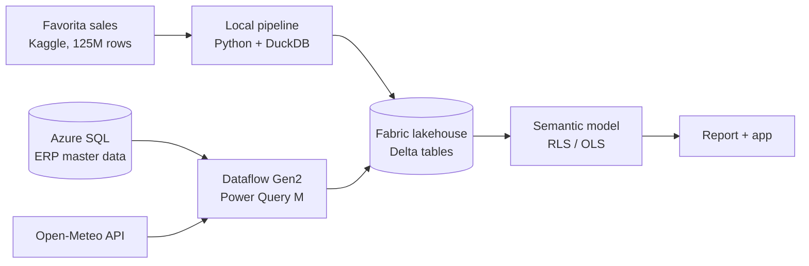

# Store Performance Cockpit

**End-to-end Power BI on Microsoft Fabric:** 125M rows of real grocery sales feed a governed
star-schema model with dynamic row-level security, CI quality checks and Dev → Test → Prod
deployment. It's built for store managers, regional managers and head office.

> **Status: in progress.** The design is complete ([spec](docs/design/2026-09-24-store-performance-design.md)).
> Implementation is running phase by phase (see [Roadmap](#roadmap)). Results sections are
> filled in as each phase ships.

---

## The problem

A discount grocer runs dozens of stores on thin margins. Every manager needs a different
slice of the same truth:

| Who | Question |
|---|---|
| Store manager (phone, daily) | How did my store do yesterday vs. target? Which fresh items look out of stock? |
| Regional manager (weekly) | Which stores are behind on like-for-like sales, and is it fewer shoppers or smaller baskets? |
| Category manager (weekly) | Which promotions really lifted sales? Where are we losing fresh sales? |
| Head office (monthly) | Is the network on plan, and which region needs attention? |

This project answers those questions from **one governed semantic model**. Each person sees
only the stores and fields they are allowed to see.

## What it demonstrates

| Capability | How | Status |
|---|---|---|
| Data modelling | Star schema: 3 facts, 3 dimensions, single-direction relationships | Designed |
| Data preparation | Python + DuckDB SQL pipeline (bronze → silver → gold) with automated data tests | Built (tests on synthetic data) |
| Multiple sources | Kaggle files, Azure SQL (ERP master data), REST API (weather) through Dataflow Gen2 / Power Query M | Planned |
| DAX | Calculation group for time intelligence, like-for-like, basket decomposition, promotion uplift | Planned |
| Security | Dynamic RLS from an access table, OLS on cost, app audiences per persona | Planned |
| Governance and deployment | PBIP/TMDL in Git, Best Practice Analyzer in CI, Fabric deployment pipeline Dev → Test → Prod | Planned |
| Performance | Benchmark of Import vs. composite aggregations vs. Direct Lake in DAX Studio | Planned |
| UX | Requirements, Figma design system, usability test with 5 users, v1 → v2 iteration | Planned |

## Architecture



Full detail, including the table contract, star schema, workspaces and release flow, is in
[docs/architecture.md](docs/architecture.md).

## Tech stack

Microsoft Fabric (Lakehouse, Dataflow Gen2, Data pipelines, deployment pipelines, Git integration) ·
Power BI (PBIP, TMDL, PBIR, DAX, Power Query M) · Azure SQL Database · Python · DuckDB ·
Tabular Editor 2 · DAX Studio · GitHub Actions · Figma

## Repository layout

```
pipeline/   Python + DuckDB data preparation and tests
erp/        Azure SQL schema and SQL tests
fabric/     Power BI project (semantic model + report)
design/     Figma exports and Power BI theme
docs/       architecture, design, decisions, requirements, results
```

## Run it locally

Requires Python 3.11+ and a Kaggle account that has accepted the
[Favorita competition rules](https://www.kaggle.com/c/favorita-grocery-sales-forecasting/rules).

```bash
cd pipeline
python -m venv .venv
.venv/Scripts/python -m pip install -e ".[dev]"
.venv/Scripts/python -m pytest -q        # tests run on a synthetic fixture, no download needed
cd ..
pipeline/.venv/Scripts/python -m pip install kaggle
pipeline/.venv/Scripts/kaggle competitions download -c favorita-grocery-sales-forecasting -p data/download
pipeline/.venv/Scripts/python -m retail_pipeline extract --src data/download --dest data/raw
pipeline/.venv/Scripts/python -m retail_pipeline build --raw data/raw --out data/full
pipeline/.venv/Scripts/python -m retail_pipeline build --raw data/raw --out data/sample --sample
```

`build` stops before exporting anything if a data check fails.

## Results

Results are added as each phase ships:

| Evidence | Where | Status |
|---|---|---|
| Data tests and CI | `pipeline/tests`, GitHub Actions | Pending |
| RLS/OLS test matrix | `docs/security.md` | Pending |
| Performance benchmark | `docs/performance.md` | Pending |
| Usability test (5 participants) | `docs/usability/` | Pending |
| Demo video | This README | Pending |

## Roadmap

- [x] Design and architecture
- [ ] Phase 1: data pipeline, synthetic ERP data, requirements
- [ ] Phase 2: Fabric platform, Azure SQL, dataflow, semantic model v1, CI
- [ ] Phase 3: security, deployment pipeline, report v1
- [ ] Phase 4: performance benchmark, usability round 1
- [ ] Phase 5: report v2, evidence docs
- [ ] Phase 6: demo video and final polish

## Data and attribution

- **Sales data:** [Corporación Favorita Grocery Sales Forecasting](https://www.kaggle.com/c/favorita-grocery-sales-forecasting) (Kaggle). It's downloaded by script and never redistributed in this repository.
- **Weather data:** [Open-Meteo.com](https://open-meteo.com/) (CC BY 4.0).
- **Synthetic data:** prices, costs, targets, regions and user access are synthetic. They're generated by a seeded script because the public dataset contains units only. Every synthetic column is documented in `docs/requirements.md`.
