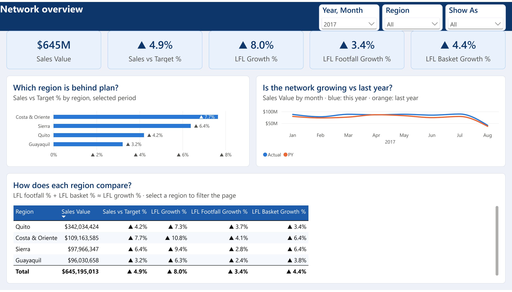
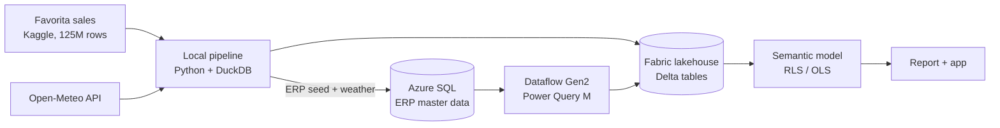

# Store Performance Cockpit

[](https://github.com/zakaria17amir/store-performance-fabric/actions/workflows/ci.yml)

**End-to-end Power BI on Microsoft Fabric:** 125M rows of real grocery sales feed a governed
star-schema model with dynamic row-level security, CI quality checks and Dev → Test → Prod
deployment. It's built for store managers, regional managers and head office.

> **Status: in progress.** The whole chain runs on Microsoft Fabric with the full 125M rows:
> - the data platform and the semantic model;
> - five reports built from a Figma design;
> - Dev → Test → Prod deployment;
> - row-level and object-level security, tested for four test users.
>
> Report v2 fixes most issues from the v1 review. The persona walkthrough and the storage-mode
> benchmark are next.
> The [spec](docs/design/2026-09-24-store-performance-design.md) has the full design.

---

## The problem

A discount grocer runs dozens of stores on thin margins. Every manager needs a different
slice of the same truth:

| Who | Question |
|---|---|
| Store manager (phone, daily) | How did my store do yesterday vs. target? Which fresh items look out of stock? |
| Regional manager (weekly) | Which stores are behind on like-for-like sales, and is it fewer shoppers or smaller baskets? |
| Category manager (weekly) | Which promotions really lifted sales? Where are we losing fresh sales? |
| Head office (monthly) | Is the network on plan, and which region needs attention? |

This project answers those questions from **one governed semantic model**. Each person sees
only the stores and fields they are allowed to see.



More pages:
- [Store performance](docs/images/report/store-performance.png)
- [Fresh and availability](docs/images/report/fresh-and-availability.png)
- [Promotions](docs/images/report/promotions.png)
- [Store today](docs/images/report/store-today.png) (also has a phone layout)

The design and wireframes are in [design/](design/README.md).

## What it demonstrates

| Capability | How | Status |
|---|---|---|
| Data modelling | Star schema: 3 facts, 3 dimensions, single-direction relationships | Built: TMDL model with 8 relationships |
| Data preparation | Python + DuckDB SQL pipeline (bronze → silver → gold) with automated data tests | Built: full 125M-row build in about 2 minutes, checks block the upload |
| Multiple sources | Kaggle files, Azure SQL (ERP master data), REST API (weather) through Dataflow Gen2 / Power Query M | Built |
| DAX | Calculation group for time intelligence, like-for-like, basket decomposition, promotion uplift | Built: 25 measures, 7 time calculations; totals match the source to the cent |
| Security | Dynamic RLS from an access table, OLS on cost, app audiences per persona | Built and tested in Desktop and in the Service (by impersonation); one report per audience |
| Governance and deployment | PBIP/TMDL/PBIR in Git, Best Practice Analyzer in CI, Fabric deployment pipeline Dev → Test → Prod | Built: Git-synced Dev, a parameter rule for the full lakehouse in Test/Prod, and a data pipeline for refreshes |
| Performance | Benchmark of Import vs. composite aggregations vs. Direct Lake in DAX Studio | Import measured on full data: 4 of 6 page queries under 500 ms, and a 1 GB per-query failure fixed ([performance](docs/performance.md)) |
| UX | Requirements, Figma design system, persona walkthrough with the four test accounts, v1 → v2 iteration | Figma wireframes, a colour-blind-checked theme, report v1 → v2 (5 of 6 review fixes), walkthrough answer key checked on Prod |

## Architecture



Full detail, including the table contract, star schema, workspaces and release flow, is in
[docs/architecture.md](docs/architecture.md).

## Tech stack

Microsoft Fabric (Lakehouse, Dataflow Gen2, Data pipelines, deployment pipelines, Git integration) ·
Power BI (PBIP, TMDL, PBIR, DAX, Power Query M) · Azure SQL Database · Python · DuckDB ·
Tabular Editor 2 · DAX Studio · GitHub Actions · Figma

## Repository layout

```
pipeline/   Python + DuckDB data preparation and tests
erp/        Azure SQL schema and SQL tests
fabric/     Power BI project (semantic model + five reports) and Dataflow Gen2 queries
design/     Figma exports and Power BI theme
docs/       architecture, design, decisions, requirements, results
```

## Run it locally

Requires Python 3.11+ and a Kaggle account that has accepted the
[Favorita competition rules](https://www.kaggle.com/c/favorita-grocery-sales-forecasting/rules).

```bash
cd pipeline
python -m venv .venv
.venv/Scripts/python -m pip install -e ".[dev]"
.venv/Scripts/python -m pytest -q        # tests run on a synthetic fixture, no download needed
cd ..
pipeline/.venv/Scripts/python -m pip install kaggle
pipeline/.venv/Scripts/kaggle competitions download -c favorita-grocery-sales-forecasting -p data/download
pipeline/.venv/Scripts/python -m retail_pipeline extract --src data/download --dest data/raw
pipeline/.venv/Scripts/python -m retail_pipeline build --raw data/raw --out data/full
pipeline/.venv/Scripts/python -m retail_pipeline build --raw data/raw --out data/sample --sample
```

Paths are for Windows (`.venv/Scripts`); on macOS/Linux use `.venv/bin`. The Kaggle CLI
needs an API token in `~/.kaggle/kaggle.json`.

`build` stops before exporting anything if a data check fails.

The semantic model and its quality gate are described in [fabric/README.md](fabric/README.md).
`python -m retail_pipeline service-check benchmark|rls|totals` (with the `azure` extra) runs the
benchmark, the security matrix and the totals check against a published model.
The Fabric side runs on a paid F2 capacity that is paused when idle ([ADR-011](docs/decisions/ADR-011-paid-f2-capacity.md)).

## Results

Results are added as each phase ships:

| Evidence | Where | Status |
|---|---|---|
| Data tests and CI | `pipeline/tests`, GitHub Actions, [data profile](docs/data-profile.md) | Passing on the real data |
| RLS/OLS test matrix | [docs/security.md](docs/security.md) | Pass for all 4 test users, in Desktop (sample) and in the Service (Prod, full data) |
| Model totals vs source | [fabric/README.md](fabric/README.md#checks-against-the-published-model) | 20 of 20 year × region cells equal |
| Performance benchmark | [docs/performance.md](docs/performance.md) | Import measured; storage-mode comparison pending |
| Persona walkthrough (4 test accounts) | [docs/usability/protocol.md](docs/usability/protocol.md) | Tasks and answer key ready; walkthrough pending |
| Report v2 backlog | [docs/report-v2-backlog.md](docs/report-v2-backlog.md) | 5 of 6 items done in v2; performance item open |

## Data and attribution

- **Sales data:** [Corporación Favorita Grocery Sales Forecasting](https://www.kaggle.com/c/favorita-grocery-sales-forecasting) (Kaggle). It's downloaded by script and never redistributed in this repository.
- **Weather data:** [Open-Meteo.com](https://open-meteo.com/) (CC BY 4.0).
- **Synthetic data:** prices, costs, targets, regions and user access are synthetic. They're generated by a seeded script because the public dataset contains units only. Every synthetic column is documented in `docs/requirements.md`.
