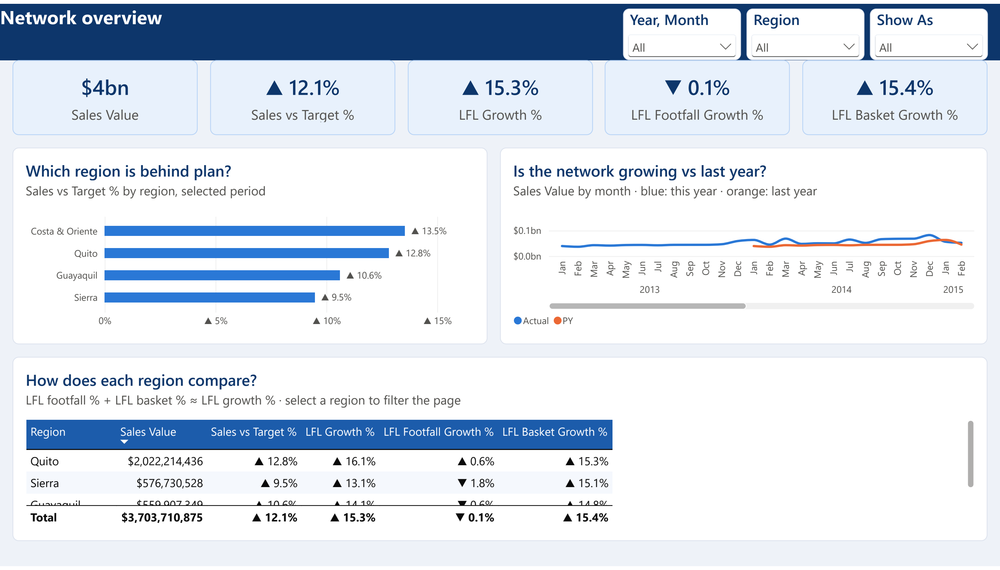
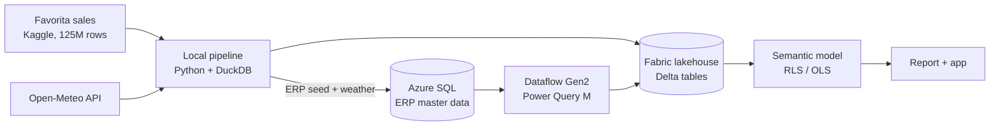

# Store Performance Cockpit

[](https://github.com/zakaria17amir/store-performance-fabric/actions/workflows/ci.yml)

**End-to-end Power BI on Microsoft Fabric:** 125M rows of real grocery sales feed a governed
star-schema model with dynamic row-level security, CI quality checks and Dev → Test → Prod
deployment. It's built for store managers, regional managers and head office.

> **Status: complete.** The whole chain runs on Microsoft Fabric with the full 125M rows, from a
> local data pipeline to a published Power BI app with four audiences. The
> [spec](docs/design/2026-09-24-store-performance-design.md) has the full design, and
> [Limits](#limits) lists what was scoped down.

## Highlights

- **125M sales rows, checked end to end.** The model's totals match the source to the cent (20 of
  20 year × region cells). The full Import model refreshes in 13 minutes on an F2 capacity.
- **Fast.** All six heaviest page queries run under the 500 ms target on full data. Import was
  picked over Direct Lake and composite by [benchmark](docs/performance.md#storage-mode-comparison).
- **Secure.** Dynamic row-level security from an access table, plus object-level security on cost.
  The security matrix was verified for four test users in Desktop and in the Service, by
  impersonating each user through the API.
- **Governed.** The model and reports are code (TMDL and PBIR) in Git. Every pull request runs a
  Best Practice Analyzer gate and pipeline tests. Releases go Dev → Test → Prod through a Fabric
  deployment pipeline.
- **Two real bugs caught by full-data checks.**
  - The data's last day ended mid-month, so "same period last year" compared half of August 2017
    with all of August 2016. That turned August like-for-like growth from ▲ 7.9% into ▼ 46.5%.
  - One measure design exceeded F2's 1 GB per-query memory limit.

  Both were fixed and are documented in [ADR-012](docs/decisions/ADR-012-sales-value-iterates-fact.md)
  and the [KPI glossary](docs/kpi-glossary.md).

---

## The problem

A discount grocer runs dozens of stores on thin margins. Every manager needs a different
slice of the same truth:

| Who | Question |
|---|---|
| Store manager (phone, daily) | How did my store do yesterday vs. target? Which fresh items look out of stock? |
| Regional manager (weekly) | Which stores are behind on like-for-like sales, and is it fewer shoppers or smaller baskets? |
| Category manager (weekly) | Which promotions really lifted sales? Where are we losing fresh sales? |
| Head office (monthly) | Is the network on plan, and which region needs attention? |

This project answers those questions from **one governed semantic model**. Each person sees
only the stores and fields they are allowed to see.



More pages:
- [Store performance](docs/images/report/store-performance.png)
- [Fresh and availability](docs/images/report/fresh-and-availability.png)
- [Promotions](docs/images/report/promotions.png)
- [Store today](docs/images/report/store-today.png) (also has a phone layout)

The design and wireframes are in [design/](design/README.md).

## What it demonstrates

| Capability | How | Status |
|---|---|---|
| Data modelling | Star schema: 3 facts, 3 dimensions, single-direction relationships | Built: TMDL model with 8 relationships |
| Data preparation | Python + DuckDB SQL pipeline (bronze → silver → gold) with automated data tests | Built: full 125M-row build in about 2 minutes, checks block the upload |
| Multiple sources | Kaggle files, Azure SQL (ERP master data), REST API (weather) through Dataflow Gen2 / Power Query M | Built |
| DAX | Calculation group for time intelligence, like-for-like, basket decomposition, promotion uplift | Built: 25 measures, 7 time calculations; totals match the source to the cent |
| Security | Dynamic RLS from an access table, OLS on cost, app audiences per persona | Built and tested in Desktop and in the Service (by impersonation); app published with 4 audiences, each seeing only its reports |
| Governance and deployment | PBIP/TMDL/PBIR in Git, Best Practice Analyzer in CI, Fabric deployment pipeline Dev → Test → Prod | Built: Git-synced Dev, a parameter rule for the full lakehouse in Test/Prod, and a data pipeline for refreshes |
| Performance | Benchmark of Import vs. composite vs. Direct Lake on full data | Import chosen ([ADR-003](docs/decisions/ADR-003-storage-mode-by-benchmark.md)): all 6 page queries under 500 ms; Direct Lake 2–3× slower and throttled F2; a 1 GB per-query failure fixed |
| UX | Requirements, Figma design system, persona walkthrough with the four test accounts, v1 → v2 iteration | Figma wireframes, a colour-blind-checked theme, report v1 → v2 (all 6 review items closed), persona walkthrough 6 of 6 |

## Architecture


```mermaid
flowchart LR
    K["Favorita sales<br/>Kaggle, 125M rows"] --> P["Local pipeline<br/>Python + DuckDB"]
    W["Open-Meteo API"] --> P
    P -->|"ERP seed + weather"| S[("Azure SQL<br/>ERP master data")]
    S --> DF["Dataflow Gen2<br/>Power Query M"]
    P --> LH[("Fabric lakehouse<br/>Delta tables")]
    DF --> LH
    LH --> SM["Semantic model<br/>RLS / OLS"]
    SM --> R["Report + app"]
```

Full detail, including the table contract, star schema, workspaces and release flow, is in
[docs/architecture.md](docs/architecture.md).

## Tech stack

Microsoft Fabric (Lakehouse, Dataflow Gen2, Data pipelines, deployment pipelines, Git integration) ·
Power BI (PBIP, TMDL, PBIR, DAX, Power Query M) · Azure SQL Database · Python · DuckDB ·
Tabular Editor 2 · DAX Studio · GitHub Actions · Figma

## Repository layout

```
pipeline/   Python + DuckDB data preparation and tests
erp/        Azure SQL schema and SQL tests
fabric/     Power BI project (semantic model + five reports) and Dataflow Gen2 queries
design/     Figma exports and Power BI theme
docs/       architecture, design, decisions, requirements, results
```

## Run it locally

Requires Python 3.11+ and a Kaggle account that has accepted the
[Favorita competition rules](https://www.kaggle.com/c/favorita-grocery-sales-forecasting/rules).

```bash
cd pipeline
python -m venv .venv
.venv/Scripts/python -m pip install -e ".[dev]"
.venv/Scripts/python -m pytest -q        # tests run on a synthetic fixture, no download needed
cd ..
pipeline/.venv/Scripts/python -m pip install kaggle
pipeline/.venv/Scripts/kaggle competitions download -c favorita-grocery-sales-forecasting -p data/download
pipeline/.venv/Scripts/python -m retail_pipeline extract --src data/download --dest data/raw
pipeline/.venv/Scripts/python -m retail_pipeline build --raw data/raw --out data/full
pipeline/.venv/Scripts/python -m retail_pipeline build --raw data/raw --out data/sample --sample
```

Paths are for Windows (`.venv/Scripts`); on macOS/Linux use `.venv/bin`. The Kaggle CLI
needs an API token in `~/.kaggle/kaggle.json`.

`build` stops before exporting anything if a data check fails.

The semantic model and its quality gate are described in [fabric/README.md](fabric/README.md).
`python -m retail_pipeline service-check benchmark|rls|totals` (with the `azure` extra) runs the
benchmark, the security matrix and the totals check against a published model.
The Fabric side runs on a paid F2 capacity that is paused when idle ([ADR-011](docs/decisions/ADR-011-paid-f2-capacity.md)).

## Results

| Evidence | Where | Status |
|---|---|---|
| Data tests and CI | `pipeline/tests`, GitHub Actions, [data profile](docs/data-profile.md) | Passing on the real data |
| RLS/OLS test matrix | [docs/security.md](docs/security.md) | Pass for all 4 test users, in Desktop (sample) and in the Service (Prod, full data); app audiences confirmed |
| Model totals vs source | [fabric/README.md](fabric/README.md#checks-against-the-published-model) | 20 of 20 year × region cells equal |
| Performance benchmark | [docs/performance.md](docs/performance.md) | Storage mode decided: Import (Direct Lake and composite compared) |
| Persona walkthrough (4 test accounts) | [docs/usability/results.md](docs/usability/results.md) | 6 of 6 tasks answered with the expected numbers in the published app |
| Report v2 backlog | [docs/report-v2-backlog.md](docs/report-v2-backlog.md) | All 6 items closed |

## Requirements → evidence

Every user story in [docs/requirements.md](docs/requirements.md) maps to something you can see:

| Requirement | Evidence |
|---|---|
| US-01 Store manager: yesterday's sales vs. target on the phone | [Store today](docs/images/report/store-today.png) (with a phone layout); walkthrough task 1 |
| US-02 Store manager: fresh items most likely out of stock | [Store today](docs/images/report/store-today.png) 7-day list and [Fresh and availability](docs/images/report/fresh-and-availability.png); walkthrough task 2 |
| US-03 Store manager: footfall and basket vs. last year | [Store today](docs/images/report/store-today.png) receipts and basket cards |
| US-04 Regional manager: stores ranked by like-for-like growth | [Store performance](docs/images/report/store-performance.png) ranking; walkthrough task 3 |
| US-05 Regional manager: shoppers or baskets? | [Store performance](docs/images/report/store-performance.png) split table; walkthrough task 4 |
| US-06 Regional manager: drill from a store to its detail | Store detail drill-through page ([wireframe](design/wireframes/2a-store-detail.png)) |
| US-07 Category manager: promotion uplift and post-promotion dip | [Promotions](docs/images/report/promotions.png); walkthrough task 5 |
| US-08 Category manager: margin by family, hidden from store operations | [Promotions](docs/images/report/promotions.png) margin chart; OLS in [security](docs/security.md) |
| US-09 Head office: network vs. target by region, with last year | [Network overview](docs/images/report/network-overview.png); walkthrough task 6 |
| US-10 Everyone sees only what they're allowed to | [Security test matrix](docs/security.md): Desktop, Service and app audiences |
| Every visual's query under 500 ms warm on full data | [Performance](docs/performance.md) |
| WCAG AA contrast; colour never the only signal | [Design tokens](design/README.md#design-tokens-theme-v2): contrast checked, and ▲/▼ in every growth format |
| Alt text | All 39 charts, tables and cards have alt text; slicers and page titles carry visible labels |

## Limits

- **Synthetic business data.** Prices, costs, targets, regions and user access are generated,
  because the public dataset has units only.
- **Usability.** The persona walkthrough was done by the author with the four test accounts. It
  wasn't an independent test with outside participants.
- **Storage modes.** The composite model was built but not benchmarked (see
  [ADR-003](docs/decisions/ADR-003-storage-mode-by-benchmark.md)). Cold-cache timings are partial.
- **Availability.** The Fabric capacity is paused when idle, so the app isn't publicly reachable.
  The screenshots show it on full data.

## Data and attribution

- **Sales data:** [Corporación Favorita Grocery Sales Forecasting](https://www.kaggle.com/c/favorita-grocery-sales-forecasting) (Kaggle). It's downloaded by script and never redistributed in this repository.
- **Weather data:** [Open-Meteo.com](https://open-meteo.com/) (CC BY 4.0).
- **Synthetic data:** prices, costs, targets, regions and user access are synthetic. They're generated by a seeded script because the public dataset contains units only. Every synthetic column is documented in `docs/requirements.md`.
