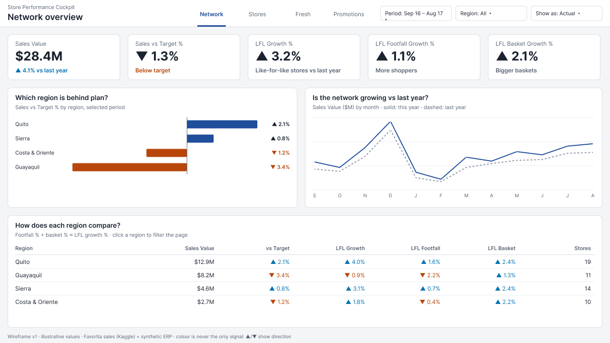

# Report design

The design lives in Figma: [Store Performance Cockpit – Report design](https://www.figma.com/design/nO3cIoiq22TiEOd6QO0DE6/Store-Performance-Cockpit-%E2%80%93-Report-design?node-id=0-1).
PNG exports of each frame are in `wireframes/`.

## Wireframes v1

Each page answers its personas' questions from the [requirements](../docs/requirements.md).

| Frame | For | User stories |
|---|---|---|
| [1 Network overview](wireframes/1-network-overview.png) | Head office, regional managers | US-09 |
| [2 Store performance](wireframes/2-store-performance.png) | Regional managers | US-04, US-05 |
| [2a Store detail (drill-through)](wireframes/2a-store-detail.png) | Regional managers | US-06 |
| [3 Fresh and availability](wireframes/3-fresh-and-availability.png) | Store managers, category managers | US-02 |
| [4 Promotions](wireframes/4-promotions.png) | Category managers | US-07, US-08 (margin: Commercial role only) |
| [5 Phone](wireframes/5-phone.png) | Store managers | US-01, US-02, US-03 |

The canvas is 1280 × 720 on an 8-px grid, with 16 px margins and gutters. Visual titles ask
the question the visual answers, and subtitles give the measure, unit and period. The values in
the wireframes are illustrative.

## Design tokens

`store-performance-theme.json` is the Power BI theme built from the tokens ([token sheet](wireframes/design-tokens.png)). Contrast is
checked against white:

| Token | Colour | Contrast | Use |
|---|---|---|---|
| Text | `#1B2230` | 15.9:1 | Body text, values |
| Muted text | `#5A6475` | 6.0:1 | Labels, captions, axes |
| Primary | `#1F4E9A` | 8.0:1 | This year, main series |
| Good | `#0072B2` | 5.2:1 | Favourable change |
| Bad | `#B8460B` | 5.4:1 | Unfavourable change |
| Last year / target | `#8C95A6` | 3.0:1 | Comparison marks only, never text |

Good and bad are blue and orange, a pair that stays distinguishable with the common types of
colour-blindness. Colour is never the only signal: ▲ and ▼ carry the direction, and the words
"better" or "worse" appear where the favourable direction isn't obvious (for example, a drop
in lost sales).
