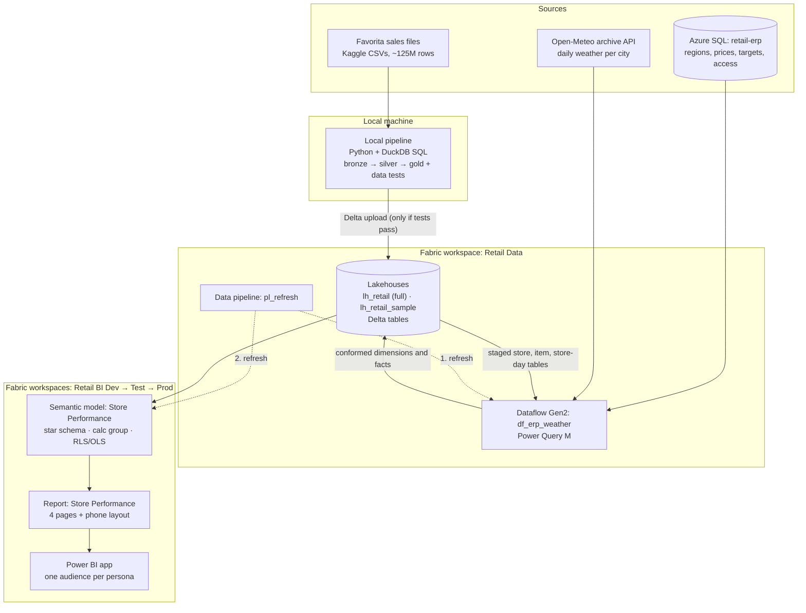
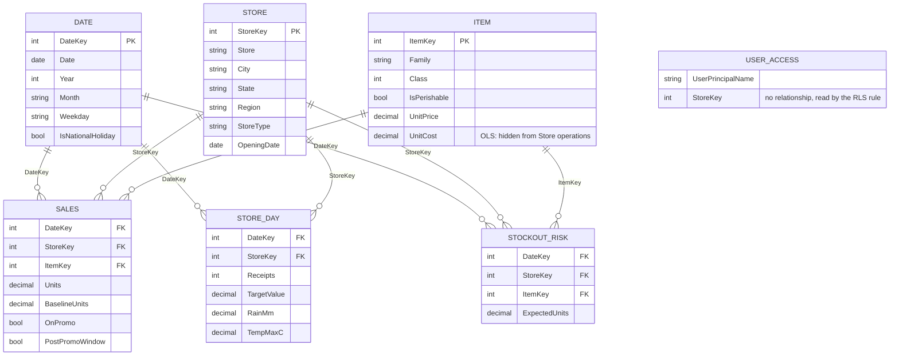
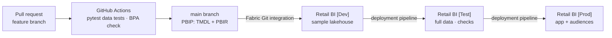

# Architecture

Store Performance Cockpit is a governed analytics product for the store network of a discount
grocery retailer. It uses real point-of-sale data from Corporación Favorita (Kaggle) as the
stand-in retailer. It combines three kinds of source (files, a SQL database and a REST API)
into one star-schema semantic model on Microsoft Fabric, secured per role and released
through Dev → Test → Prod.

The design rationale lives in [the design spec](design/2026-09-24-store-performance-design.md).
This page describes the system as built.

## Data flow

| Component | Owns | Technology |
|---|---|---|
| Local pipeline | Favorita download, cleaning, the gold star schema, derived facts (promo baseline, stock-out risk), data tests, upload | Python, DuckDB SQL, pytest, Delta Lake |
| Azure SQL `retail-erp` | ERP-style master data: state → region, store profile, item price and cost, monthly targets, weekday weights, user → store access | Azure SQL Database (free offer), T-SQL |
| Dataflow Gen2 `df_erp_weather` | Conforms ERP attributes onto the staged dimensions, joins daily targets from the ERP view, loads weather | Power Query M |
| Data pipeline `pl_refresh` | Runs the dataflow, then refreshes the semantic model | Fabric Data Factory |
| Semantic model `Store Performance` | Star schema, measures, time-intelligence calculation group, RLS and OLS | Power BI (PBIP / TMDL) |
| Report and app | Four desktop pages, a phone layout, app audiences | Power BI (PBIR) |

## Lakehouse table contract

The gold tables are the interface between data preparation and the semantic model. Each
producer can be replaced (for example DuckDB → Fabric notebook or Databricks) without touching
the model, as long as these tables keep their grain and columns.

| Table | Produced by | Grain | Used by |
|---|---|---|---|
| `dim_date` | Local pipeline | 1 row per calendar day | Model |
| `stg_store` | Local pipeline | 1 row per store (Favorita attributes, first day with receipts (full history)) | Dataflow |
| `stg_item` | Local pipeline | 1 row per item | Dataflow |
| `stg_store_day` | Local pipeline | store × day (receipts) | Dataflow |
| `fact_sales` | Local pipeline | store × item × day (units, promo flag, baseline) | Model |
| `fact_stockout_risk` | Local pipeline | store × item × day, flagged days only | Model |
| `dim_store` | Dataflow | 1 row per store (+ region, selling area) | Model |
| `dim_item` | Dataflow | 1 row per item (+ unit price, unit cost) | Model |
| `fact_store_day` | Dataflow | store × day (receipts, daily target, weather) | Model |
| `user_access` | Dataflow | user × store | Model (RLS) |
| `weather_load_errors` | Dataflow | 1 row per failed API call | Monitoring |

## Semantic model

- All relationships are one-to-many, single direction, on integer keys. No bi-directional filtering.
- `USER_ACCESS` is deliberately unrelated: the RLS rule on `Store` reads it with
  `USERPRINCIPALNAME()`, which avoids bi-directional relationships.
- Time intelligence is a calculation group; a field parameter drives the metric switcher.

## Build and release

| Workspace | Contents | Data |
|---|---|---|
| `Retail Data` | `lh_retail`, `lh_retail_sample`, `df_erp_weather`, `pl_refresh` | Full and sample |
| `Retail BI [Dev]` | Semantic model, report (Git-synced to `main`) | Sample lakehouse |
| `Retail BI [Test]` | Same items, promoted by the deployment pipeline | Full lakehouse |
| `Retail BI [Prod]` | Same items plus the Power BI app | Full lakehouse |

A deployment-pipeline data source rule points Dev at `lh_retail_sample` and Test/Prod at
`lh_retail`. Test users only get app access. Workspace members bypass RLS, so they are
never used to test security.

## Security

| Role | Row filter | Object-level security | Personas |
|---|---|---|---|
| Store operations | Stores listed for the user in `user_access` | `'Item'[Unit Cost]` hidden, so margin is unavailable | Store manager, regional manager |
| Commercial | None (all stores) | None | Category manager, head office |

App audiences decide which pages each persona sees. Roles decide which data they can see.

Role definitions, the RLS rule and the test matrix: [security.md](security.md).

## Scaling path

- **More data**: move the local pipeline into a Fabric notebook or Databricks. The table contract stays the same.
- **More sources**: add queries to the dataflow and conform them onto existing dimensions.
- **More reports**: build thin reports on the shared semantic model instead of new models.
- **More users**: add rows to `user_access`. No new roles are needed per region or store.

Weather data by [Open-Meteo.com](https://open-meteo.com/) (CC BY 4.0).
